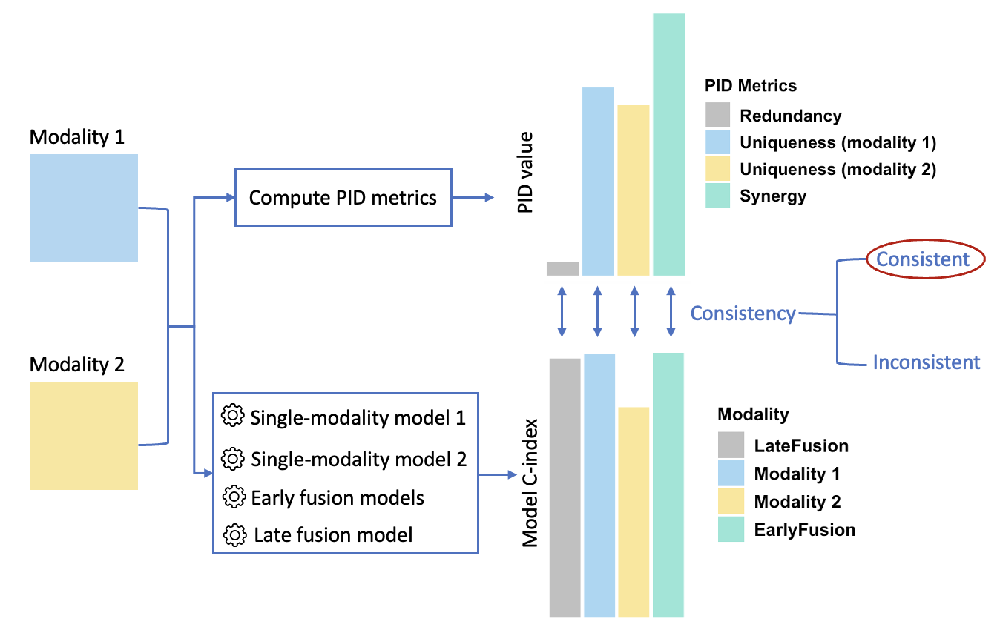

# Quantifying multimodal interactions in multimodal medical data

There has been an increasing interest in combining different modalities such as radiology, pathology, genomic, and clinical data to improve the accuracy and robustness of diagnosis and prognosis in medicine. However, most existing works choose their datasets and modeling approaches empirically and in an ad hoc manner. Four partial information decomposition (PID)-based metrics have been shown to provide a theoretical and systematic understanding of multimodal data interactions in machine learning settings: redundancy between two modalities, uniqueness of each modality, and synergy that emerges when the fused modalities induce new information. However, these metrics have only been evaluated in a limited range of biomedical data, and the existing work did not elucidate the effect of different parameterizations in calculating the PID. In this work, we further assess the PID metrics using four different multimodal radiology cohorts in lung, prostate, and brain cancers. We found that, though promising, the PID metrics were not always consistent with the machine learning model performance and only one dataset had perfect consistency. We identified potential sources of inconsistency and provided suggestions for future works.



## Data preparation 

You can download the four multimodal medical datasets used in this study [here](https://drive.google.com/drive/folders/13aZ5mFqh6dB-SVbxolOGTLOcxzYssZmx?usp=sharing). The CSV files include the features and outcomes, and the JSON files contain the data splits used for repeated cross-validation. 

To compute PID metrics and run the models, place the datasets in the `datasets` directory. The file structure is then:
```
  ├── datasets/               
  │   ├── lung_radiopathomic/ 
  │   ├── prostate_t2w_adc/   
  │   ├── ...   
  ├── linear_models 
  │   ├── ...   
  ├── nonlinear_models 
  │   ├── ...
  ├── ...         
```

## Calculate PID-based metrics 
We adapted the implementation of PID-based metrics for quantifying multimodal interactions from Liang et al. See [this repository](https://github.com/pliang279/PID/tree/1f6e9d09598754f0dcf7d4ce7e7ffe1c377b0035) for further details. 

### Step 1: Installing required packages 

To calculate PID metrics, first create a pytorch docker container with the following command:
```
docker run  --shm-size=2g --gpus all -it --rm -v /:/workspace -v /etc/localtime:/etc/localtime:ro nvcr.io/nvidia/pytorch:21.12-py3
```

See [this link](https://catalog.ngc.nvidia.com/orgs/nvidia/containers/pytorch/tags) for additional information on this docker image. 

Next, navigate to `pid_calculation` and install required packages with this command:
```
pip install -r pid_requirement.txt
```

### Step 2: Calculating PID metrics

Now, you can calculate PID metrics using the ```calculate_pid.py``` script by specifying the dataset name, number of PCA components, and the number of clusters. For example, to calculate PID metrics on the lung_radiopathomic dataset, 

```
python calculate_pid.py --dataset lung_radiopathomic --pca-components 2 --k 3
```

## Linear models 

### Step 1: Installing R and RStudio 

We implemented the linear cox models using R. To run those models: 

* Install R: https://www.r-project.org/

* Also, install RStudio: https://posit.co/download/rstudio-desktop/

### Step 2: Running linear models 

After installing R and RStudio, launch RStudio and navigate to the `linear_models` directory.

In RStudio, run the script in `concat_lung_radiopathomic.R` to run the concatenation-fused model on the lung radiopathomic dataset. The script will install necessary packages and run the model with repeated cross-validation. Similarly, you can run the canonical correlation analysis (CCA)-fused model, unimodal models, and the ensemble model on this dataset with the other three R scripts in the `linear_models` directory. 

## Nonlinear models 

### Step 1: Installing required  packages
Same as for calculating PID metrics, create a docker container:
```
docker run  --shm-size=2g --gpus all -it --rm -v /:/workspace -v /etc/localtime:/etc/localtime:ro nvcr.io/nvidia/pytorch:21.12-py3
```

Then, navigate to `nonlinear_models` and intall the [lifelines package](https://lifelines.readthedocs.io/en/latest/): 
```
pip install lifelines 
```

### Step 2: Running nonlinear models 

Next, to perform early fusion on the lung radiopathomic dataset, run: 
```
CUDA_VISIBLE_DEVICES=0 python early_fusion.py --dataset lung_radiopathomic 
```

Similarly, for tensor fusion: 
```
CUDA_VISIBLE_DEVICES=0 python tensor_fusion.py --dataset lung_radiopathomic 
```

Also, to run the ensemble model: 
```
CUDA_VISIBLE_DEVICES=0 python ensemble.py --dataset lung_radiopathomic 
```

Finally, to run unimodal models (e.g., the radiomic-only model): 
```
CUDA_VISIBLE_DEVICES=0 unimodal.py --dataset lung_radiopathomic --modality radiomic
```

The same scripts can be used to run the nonlinear models on the other three datasets by specifying dataset name and model hyperparameters. 